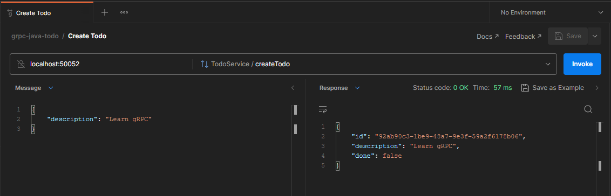
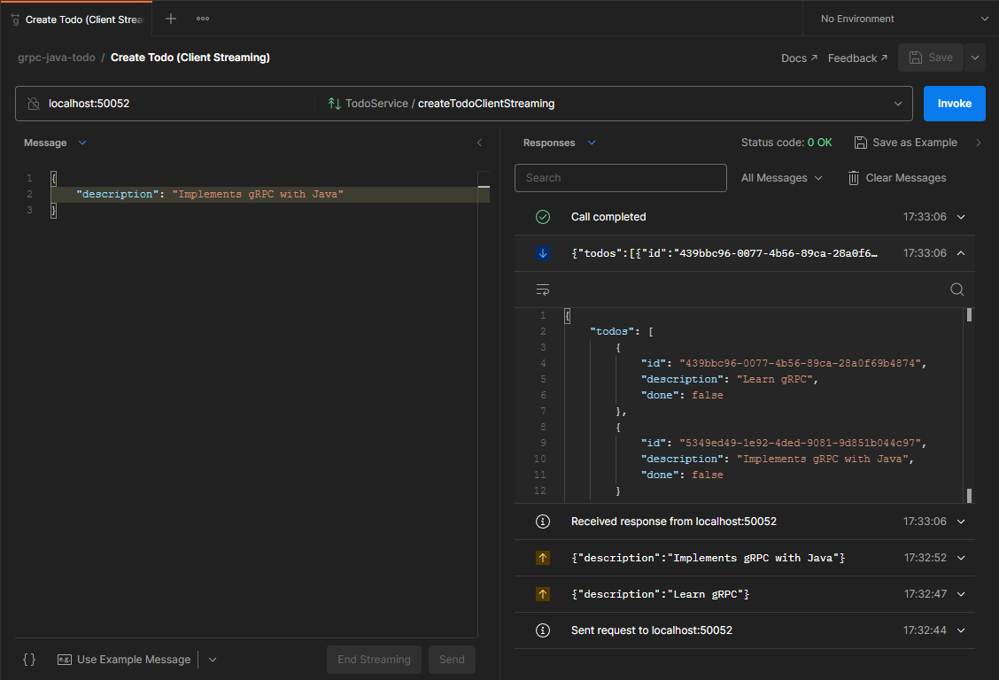
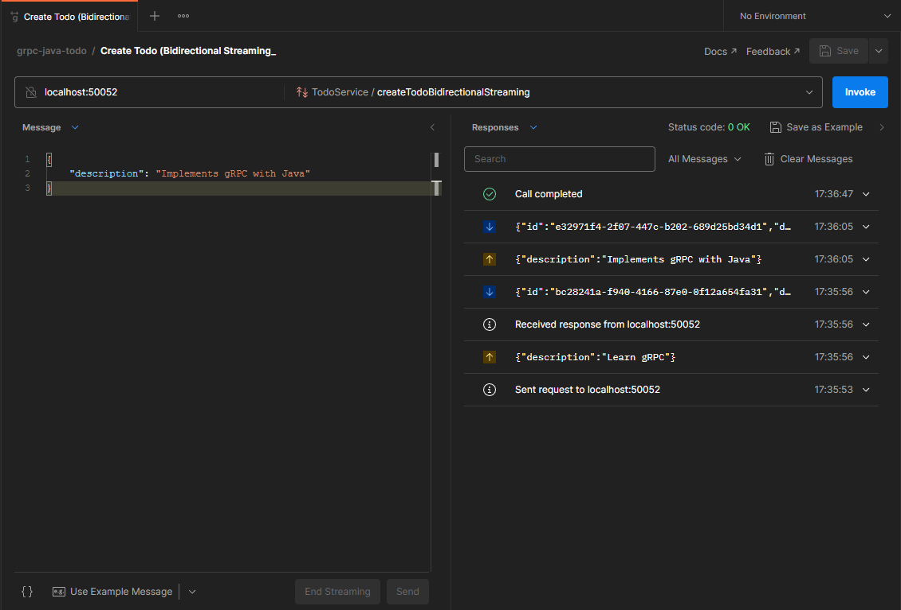

# grpc-java-todo

Projeto criado com o objetivo de colocar em prática estudo de gRPC em Java.


1. [Execução](#execução)
2. [Conceitos](#conceitos)
   1. [O que é gRPC?](#o-que-é-grpc)
   2. [REST vs gRPC](#rest-vs-grpc)
   3. [Protocol Buffers](#protocol-buffers)
   4. [Service definition](#service-definition)
3. [Demo](#demo)

## Execução
Nesse projeto existe um _client_ e um _server_. Para simular uma chamada gRPC, é necessário utilizar o gradle para baixar as dependências e rodar a task `generateProto`, que irá compilar o conteúdo existente no _.proto file_ e transformar em classes para serem implementadas em `build/generated`.
```bash
$ ./gradlew generateProto
```
Para rodar o _server_:
```bash
$ ./gradlew runServer
```

Para rodar o _client_ que irá executar uma chamada teste:
```bash
$ ./gradlew runClient
```

## Conceitos

### O que é gRPC?
Trata-se de um framework RPC (_Remote Procedure Call_ - Requisição e Resposta) que permite manter comunicações em formato streaming bidirecional, utilizando o HTTP/2.
Por padrão, utiliza Protocol Buffers para fazer a serialização dos dados.


### REST vs gRPC

| REST                     | gRPC                       |
|--------------------------|----------------------------|
| Texto/JSON               | Protocol Buffers           |
| unidirecional            | bidirecional e assíncrono  |
| alta latência            | baixa latência             |
| sem contrato             | contrato definido (.proto) |
| sem suporte a streaming  | suporte a streaming        |
| design pré-definido      | design é livre             |
| bibliotecas de terceiros | geração de código          |

### Protocol Buffers
Para trabalhar com o _protocol buffers_ é usado um arquivo _.proto_, que tem como objetivo definir as estruturas dos dados e seus respectivos serviços.
A primeira coisa a ser informado num arquivo _.proto_ é a sua versão, que costuma ser a 3.
```protobuf
syntax = "proto3";
```

A partir disso, é possível incluir algumas opções para a linguagem utilizada (Java, Go, etc...), como especificar pacotes, definir se vai ser gerado um ou vários arquivos, entre vários outros. 
```protobuf
option java_package = "com.devfreitag";
option java_multiple_files=true;
```

O principal do arquivo são as `message` e os `service`, que definem qual vai ser o escopo a ser seguido. 

Uma `message` consiste em ser o contrato de um objeto, onde é definido quais suas propriedades especificando tipo, nome e posição.

```
message Object {
  type propertyName = position;
}
```

Para utilizar as `messages` em uma chamada gRPC, é possível definir uma interface no arquivo, onde a mesma terá seu código gerado pelo compilador do _protocol buffer_.
Por exemplo, se quisermos definir que teremos uma chamada gRPC que irá criar um novo `Todo`, é possível fazer algo como:
```protobuf
syntax = "proto3";

message Todo {
  string id = 1;
  string description = 2;
  bool done = 3;
}

message CreateTodoRequest {
  string description = 1;
}

service TodoService {
  rpc CreateTodo(CreateTodoRequest) returns (Todo) {}
}
```

### Service definition
Quando definimos quais as interfaces do `service` que iremos implementar, pode ser especificado qual o tipo da requisição/resposta, sendo as opções:

- _Unary_: uma chamada RPC normal, onde o cliente envia uma requisição para o servidor e aguarda uma resposta.
- _Server streaming_: cliente envia uma única requisição para o servidor e recebe a resposta do servidor em formato _streaming_, no qual o cliente irá ler até não haver mais mensagens.
- _Client streaming_: cliente envia uma sequência de mensagens para o servidor que, por sua vez, só vai processar e retornar a resposta quando o cliente terminar de enviar.
- _Bidirectional streaming_: tanto o cliente quanto o servidor vão enviar suas mensagens em formato _streaming_, de forma independente.

## Demo
Abaixo, capturas de telas que demonstram de forma mais visual como é, na prática, feito as requisições gRPC. Foi utilizado o programa Postman como _client_.

- *Unary*:


- *Client Streaming*:


- *Bidirectional Streaming*:


